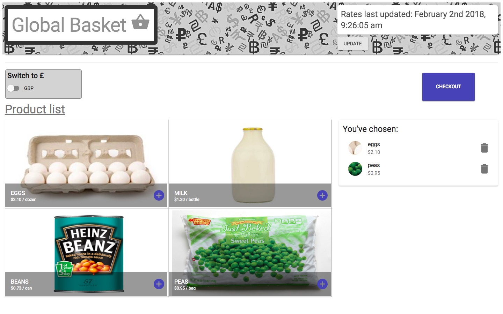
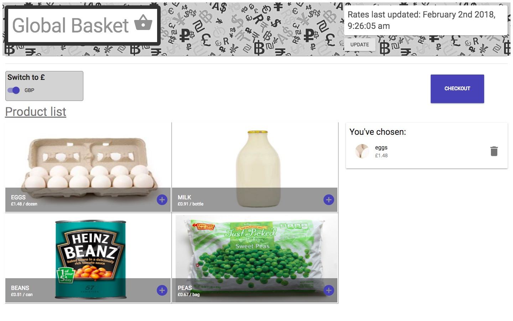
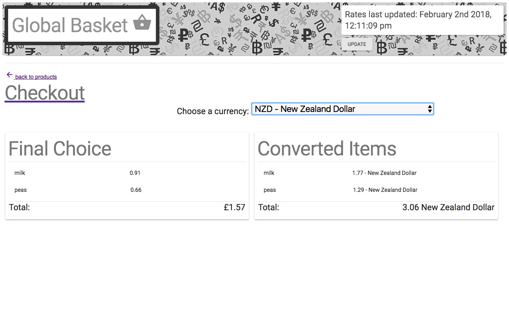

#created with create-react-app




# Global Basket
> Shopping Basket of goods in global currencies
> Data courtesy of https://currencylayer.com/

## Installing / Getting started
```
npm start
```
runs on localhost:3000/basket

CurrencyLayer requires a free API KEY - insert into App.js line 64
Sign up here: https://currencylayer.com/signup?plan=1

##
User can:
* add and remove products from a basket
* set the default currency from USD to GBP
* see total of products chosen
* see equivalent cost in global currencies
* update the data to reflect most recent exchange rates

### Built With
React (create-react-app), React Router v4, Material-UI/Material-Icons
